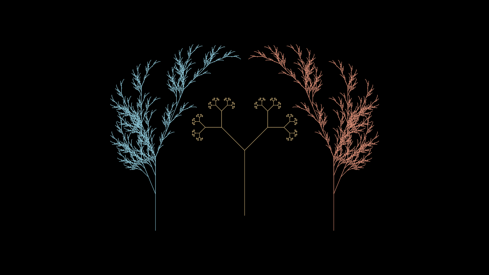

# bgmaker (Background Maker)

Create background images using C++, ImageMagick and L-Systems.
This is a WIP.

# Getting Started

## Requirements
Install the library ImageMagick. 
In Ubuntu 20.04
```bash
$ sudo apt install libmagick++-dev
```

## Build
Clone this repository and all his submodules
```bash
$ git clone --recursive https://github.com/h-valdes/bgmaker
```

```bash
$ cd bgmaker
$ mkdir build
$ cd Build
$ cmake ..
$ make
```

## Use
Inside of the build directory:
```bash
$ ./bgmaker draw
```

And to preview the image with ImageMagick
```bash
$ ./bgmaker draw --preview
```

To override the default values use the config file 
```bash
$ ./bgmaker draw --preview --config "../config.toml"
```

# Examples

## Example 1
```toml
# config.toml
[general]
output-file = "bg1.png"
background-color = "#ECEFF4"
width = 1920
height = 1080

[fractal-plant]
    [fractal-plant.fp1]
    stroke-color = "#88C0D0"
    stroke-width = 1.5
    x-offset = -350
    x-centered = true
    y-centered = true

    [fractal-plant.fp2]
    stroke-color = "#D08770"
    stroke-width = 1.5
    x-offset = 350
    x-centered = true
    y-centered = true
    mirror = true
```


## Example 2

```toml
# config.toml
[general]
output-file = "bg2.png"
background-color = "#ECEFF4"
width = 1920
height = 1080

[fractal-plant]
    [fractal-plant.fp1]
    stroke-color = "#88C0D0"
    stroke-width = 1.5
    x-centered = true
    y-centered = true
```


## Example 3

```toml
# config.toml
[general]
output-file = "bg3.png"
background-color = "#000000"
width = 1920
height = 1080

[fractal-plant]
    [fractal-plant.fp1]
    stroke-color = "#88C0D0"
    stroke-width = 1.5
    x-offset = -350
    x-centered = true
    y-centered = true

    [fractal-plant.fp2]
    stroke-color = "#D08770"
    stroke-width = 1.5
    x-offset = 350
    x-centered = true
    y-centered = true
    mirror = true

[fractal-binary-tree]
    [fractal-binary-tree.fbtree1]
    stroke-color = "#EBCB8B"
    stroke-width = 1.2
    y-offset = 75
    x-centered = true
    y-centered = true
```




